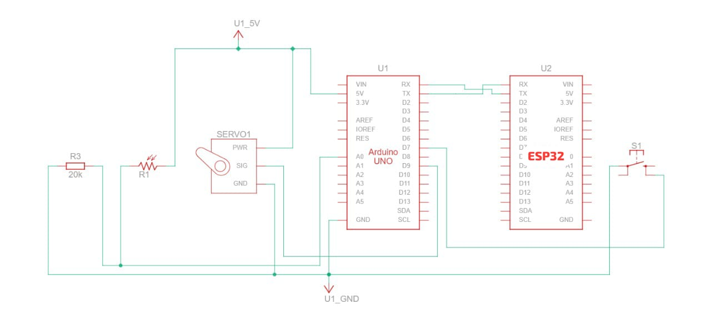

---

## 🔧 Features

- 🔒 **Li-Fi Based Unlocking**: Enter a 4-character password via light pulses.
- 📲 **Remote Password Updates** via Blynk (for 3 users).
- 🚫 **Block/Unblock Users** to prevent unauthorized access.
- 🚨 **Emergency Unlock** from Blynk app.
- 🔁 **Manual Lock Button** for physical locking.
- ✅ **Three Predefined Users**: Easily customizable credentials.
- 🔐 **Servo Lock Mechanism** controlled by Arduino UNO.

---

## 💡 How It Works

1. **Transmitter (LED)** sends a *preamble* followed by a 4-character password encoded bit-by-bit using light pulses.
2. **LDR on Arduino** receives and decodes these pulses.
3. Arduino checks if the password matches any **active** user.
4. On success: unlocks door using **Servo**.
5. Users can:
   - **Change Passwords** via Blynk
   - **Enable/Disable Access**
   - **Trigger Emergency Unlock**

---

## 📱 Blynk App Setup

- **Template ID**: `TMPL3n8Kx0Yha`
- **Device Name**: `LiFi`
- **Auth Token**: Use your own (from Blynk Dashboard)

### Virtual Pins Mapping:

| Virtual Pin | Function                  |
|-------------|---------------------------|
| V1          | Set Password - User 1     |
| V2          | Set Password - User 2     |
| V3          | Set Password - User 3     |
| V4          | Block/Unblock User 1      |
| V5          | Block/Unblock User 2      |
| V6          | Block/Unblock User 3      |
| V7          | Emergency Unlock          |

---

## 🖥️ Code Structure

### 🔸 Arduino UNO
- Li-Fi reception and decoding via `LDR`
- Password management and user validation
- Servo-based locking mechanism
- Serial communication with ESP32

### 🔸 ESP32
- Connects to WiFi & Blynk Cloud
- Sends commands to Arduino via `Serial2`

### 🔸 Transmitter
- Sends preamble and 4-character password using LED flashes
- Bit-by-bit transmission controlled via `delay(SAMPLING_TIME)`

---

## 🚀 Getting Started

1. Upload **Transmitter Code** to any Arduino board or microcontroller with an LED.
2. Upload **Arduino Code** to Arduino UNO.
3. Upload **ESP32 Code** to your ESP32 (setup WiFi + Blynk).
4. Connect:
   - ESP32 TX → Arduino RX (with voltage divider)
   - ESP32 RX ← Arduino TX (direct)
   - LDR to Arduino A0
   - Servo to Pin 9
   - Manual Lock Button to Pin 7

---

## 🧪 Sample Passwords

| User | Default Password | Status   |
|------|------------------|----------|
| 1    | `MPMC`           | Enabled  |
| 2    | `PICO`           | Enabled  |
| 3    | `1234`           | Enabled  |

---

## 🔐 Security Considerations

- Light-based transmission is **line-of-sight**, making it more secure than RF in enclosed environments.
- Passwords are **user-specific** and **remotely updateable**.
- Emergency unlock acts as a failsafe but can be monitored via logs.

---

## 📸 Circuit Diagram

---

### 🔮 Future Improvements

- **🔐 Encrypted Li-Fi Transmission**  
  Secure the light-based communication by integrating lightweight encryption algorithms to prevent unauthorized interception and spoofing.

- **📱 Mobile App Extension**  
  Replace or enhance the current Blynk interface with a dedicated mobile app, offering a smoother and more customized user experience.

- **💡 Flashlight-Based Mobile Transmitter**  
  Develop a feature within the mobile app that allows the phone's flashlight to act as a Li-Fi transmitter, eliminating the need for a separate transmitter device.

- **🚨 Intrusion Detection Alerts**  
  Implement logic to detect repeated failed access attempts or unauthorized tampering, and send real-time alerts to the user via mobile notification or email.
 Expand to **multi-room support** with RFID fallback.

---

## 👨‍💻 Author

- Rohit Kumar Singh

---

## 📄 License

MIT License. Feel free to use and modify with attribution.

---

## 🙌 Acknowledgments

- Blynk IoT Platform
- Arduino Community
- ESP32 Documentation
